# Damien Meere - BT Ireland
### Full Stack Frameworks with Django Milestone Project - Code Institute

<p align="center">
    
</p>

## Introduction

This project website will highlight my capability to employ the various tools illustrated throughout the entirety of the Code Institute programme. The purpose of this project is to
build a full-stack django-based site, with the requisite business logic to support all aspects of an online store. This django-enabled site allows an admin to create, store and 
manipulate product records, which are then presented to the site visitors/customers. Customers can create their own profiles, view and sort all products depending on their requirements,
sign up for mailing lists, view the available inventory on products and leave reviews for products they have purchased. 

All functionality relating to both site admins and customers is laid out within the [UX + User Stories](#UX+User-Stories) section below. 

This project is built upon the Django framework and follows the model-template-view architecture pattern. Sqlite was utilised during development as the database for local testing.
Sqlite is a relational database management system (RDBMS) embedded within the application itself. Within the [deployed site](https://dmeere-thecomicstore.herokuapp.com/), Postgres is 
employed as the Database to house all data. Postgres is an open source object-relational database management system. The data structures and associated applications models are 
detailed in the [Database](#Database) section. Within the deployed site, Amazon Simple Storage Service (Amazon S3), a Cloud-based object storage service, is utilised to store the static (js, css),
and media folders (site images).

Utilising Django and the DBMS highlighted above, site admins, can access a customised Django-supported Admin Dashboard where they can Create, Read, Update and Delete records within the 
various application models (Products, Users, Orders, Product Reviews etc.), as illustrated in the following image:

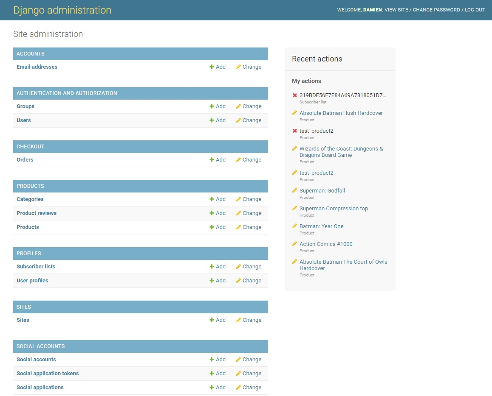

Throughout the development of the project, [Git](https://git-scm.com/) & [Github](https://github.com/) were employed to support version control. The [Github Repository](https://github.com/damien-meere/full_stack_milestone) 
for the project is linked directly to the [Heroku-deployed site](https://dmeere-thecomicstore.herokuapp.com/).


## Table of Contents

- [Demo](#Demo)
- [UX + User Stories](#UX+User-Stories)
- [Site Design](#Site-Design)
- [Technologies](#Technologies-Used)
- [Database](#Database)
- [Current Features](#Current-Features)
- [Future Features](#Future-Features)
- [Testing](#Testing)
- [Deployment](#Deployment)
- [Internal Deployment](#Internal-Deployment)


## Demo
A live demo of the project can be found deployed to Heroku [Here](https://dmeere-thecomicstore.herokuapp.com/)


## UX+User-Stories

The goal of project was to build a full-stack site with the business logic to support the sale of products to customers/site visitors. In this case,
the site supports a comic book store's online presence. The main actors involved in the site are **customers** (both logged in and anonymous), and the 
**site admin**. The various interations with the site can be broken out into 5 key domains:
*   Product View & Navigation
*   Registration and Individual User Account Functionality
*   Sort & Search of Products
*   Purchasing & Checkout
*   Admin & Product Management

The checklist used to track the user stories can be accessed here - 

### Product View & Navigation
####    View products
All site users need to be able to identify items for purchase on the site with minimal effort. They need to be able to easily navigate to a central
respoitory and view all available products, and view high level information relating to each product (Name, Image, Price, Rating). This requirement is
fulfulled within the Main Product Page which presents a view of the Product catalogue. The design of this main product page will be presented and 
discussed in the upcoming section - [Site Design](#Site-Design).
####    View individual product details
All site users need to be able to focus in and delve into more specific details relating to a particular product - price, product description, 
applicable sizes for clothing, Product Images, Inventory Availability, Ratings and Product Reviews. All of this information is in place to attract the 
customer and promote the purchase of the product. This functionality Again, the design of the product detail page will be disucssed within the Site Design Section.
####    View categories of products
It's hugely important that site users are able to filter the list of avilable products. In many cases with these types of sites, there can be a 
substantial list of products available. Therefore, users need to be able to narrow the search parameters and limit their view of available products to
the general area of interest. In this case, this user story is fulfulled throught the assingment of categories to the individual products. This is detailed in the [Database](#Database), where the 
Product is presented in detail. The Categories, and their associated menu times enable the site users to select the type of product they wish to view. The following are the categories that site 
users can filter their product view on:
*   All products 
    *   Arranged by Price, 
    *   Arranged byRatings,
    *   Arranged by Category,
*   Books
    *   Comics
    *   Graphic Novels
    *   Magazines
*   Games
    *   Board Games
    *   Card Games
*   Apparel
    *   Hats
    *   Shirts
*   Special Offers
    *   New arrrivals
    *   Deals
    *   Clearance

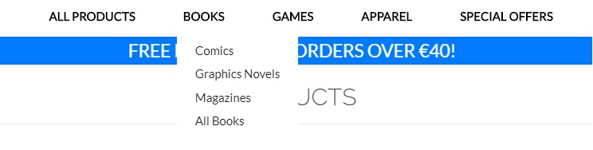

####    Identify any clearance items or available discounts
As with all online stores, the primary goal is to drive business, and push customers to complete purchases. With that in mind, it's very important that customers can easily identify and take advantage
of offers/deals, and gain access to any price reductions across the site. In order to fulful this user story, the Special offers menu option was added, as detailed above. The Categories that fall under
this seciton heading are as follows:
*   New arrrivals
*   Deals
*   Clearance

By filtering the product list on on these categories, users can quickly identify priced reduced items. As such, it increases the chances of customers adding these items to their shopping bag.

####    View total for all queued items for purchase
Customers need to be able to keep track of the total cost of all items they're added to their shopping bag during a session. With each item that's added,
customers must be able to see at all times what charges they can expect, including any delivery charges. This user story is fulfilled though the use
of the shopping bag placeholder in the navbar (top right of page). At all times, this figure is updated based on the input of the user.

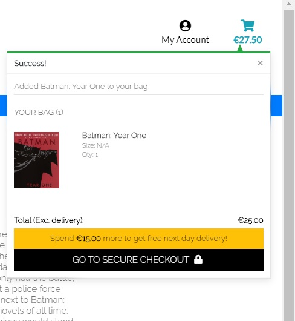

####    View Inventory Status of a product
It's important that when purchasing a product, Customers can be assured that their order can be fulfilled. With that in mind, when customers view the
details for a specific product, when they go to add the product to their shopping bag, they are presented with a view of the inventory level for that
specific product. As shown below, the inventory levels are reflected, so as to promote the completion of purchases.

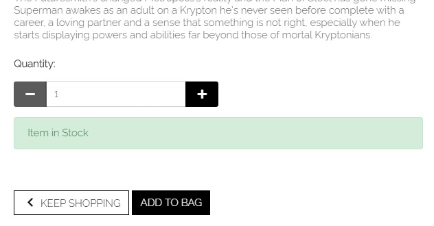

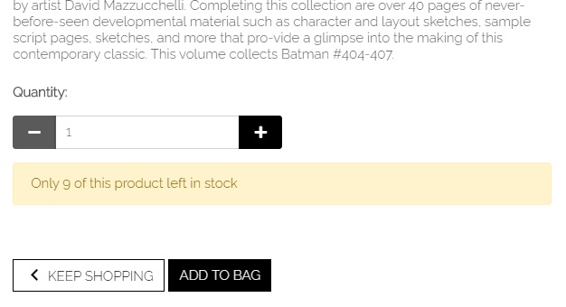

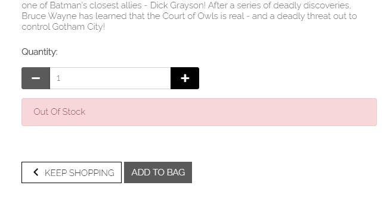


### Registration and Individual User Account Functionality
####    Register for an account
In order for customers to build a relationship with the site, they need to be able to create an account on the site. Having an individual user account
enables the user to save their details, so that when accessing the site in future, their details are already saved. This makes it easier for the user
to complete purchases, and so drives additional business. 

As detailed in the upcoming [Database](#Database) section, Django’s out-of-the-box authentication system provides the base structures for authorising, authenticating and accounting for all
user interactions with the platform. The authentication system is bundled within the Django contrib module in django.contrib.auth. This handles the creation of user accounts, 
facilitation of permissions and cookie-based user sessions.

####    Login/Logout
Site users need to be able to login and logout as they need to (e.g. shared devices). Again, building on the Django Authentication system, once a user account has been created, 
the users can very easily logout via the 'My Account' button on the navigation bar. So at any point on the site, the user can log out. 

####    Recover password if necessary
Site Users should be able to reset/recover their password should they need to. Again, the benefit of building this site on a robust platform like 
Django, is that the out-of-the-box authentication handles this functionality. Should the user require it, the authentication system will enable the user
to supply their email address and have they'll receive an e-mail allowing them to reset it.

####    Email confirmation with registration
It's important that the site have accurate email address information for all users. As we saw in the previous section, when resetting an account password,
when completing an Order and receiving the Order confirmation, the user email address is required to faciliate any communications with the user. Therefore,
when creating a new account, in order to finalise the account creation, the user is required to supply an email address. The user receives an email with
a link to verify their account and confirm their new account on the site. Until their email is verified, they cannot access their account. 

####    Up to date personalised account
One of the reasons for needing a profile is to maintain user information, so that users can view a history of their purchases, view order confirmations,
manage their delivery information. This user story is faciliated within the User's own profile page which enables the user to supply/update their 
delivery information, and view all previous orders.

####    Mailing List
It's important that stores cultivate a relationship with their customers. One good way of doing this is the creation of a mailing list, that enables
the store to circulate details of upcoming product releases, Price reductions, Ongoing Deals, Upcoming events etc. Within this site, this user story
is facilitated through two mechanisms. Anonymous users (with no Profile), can sign up to be a part of the mailing list via the mailing list button on
the home page. Customers with a registered account can elect to join the mailing list via their profile page, where they cna check the checkbox to join.


### Sort & Search of Products
####    Sort products into an appropriate order
As highlighted in previous user stories, central to any eCommerce site is the capability to effectively sort product lists so as to easily identify requisite products based on chosen 
criteria. To facilitate this capability, within the navbar, the site users have the option of sorting all products according to Price, Rating or Category. 

####    Sort products into categories
Site users need to be able to quickly locate the products they require. the longer it takes a user to find what they want, the more likely it is that they will take their business elsewhere. Therefore
to facilitate easier filtering of products, users can limit their view of products within the specific categories as detailed in the [View Category](#View-categories-of-products) user story. They can
simply select the requisite category from the navbar.

####    Search for products by name or description
Customers may have more specific criteria that they are searching for. So rather then just relying on broad categorys to try and isolate the requisite product, customers can specifically input their
own search parameters to either identify a single product, or zone in on a number of products that match the users inputted search criteria. This user story is faciliated via the search field within
the sites nav bar. When the user inputs their parameters, the Name and Description field of each product is queried. If any products match that criteria, they are presented to the user.

####    Easily view search results
Search parameters entered by a user can return a broad range of results, depending on the criteria entered. Therefore depending on the results, users must still be presented with a suitbale view to 
peruse through the resultant list of products. This user story is fulfilled within the site as when the user inputs a search parameter, the results are presented to the user in the exact same format
as when products are sorted or filtered from the navbar menu.


### Purchasing & Checkout
####    Select size (where applicable) and quantity of product for purchasing
Within the site certain items, typically clothing, require input from the user to select the requisite sixe (Small, medium, Large, Extra-Large etc.) Where appropriate, customers preference  with regards
the item size needs to be harnessed. Within the Product management menu (available to superusers), and the Django admin portal, Site Admins can create/edit products. When they do, the admin has the 
option to determine whether the product "Has Sizes". If the Admin user responds with a Yes, when a customer accesses the specific Product detail page, they are presented with an option to select the 
required size as illustrated below.


####    View all items that I've selected to add to shopping bag
Once a customer has selected (Added to their Bag) all products they wish to purchase, they need to be able to review this product list before proceeding to the payment. Therefore to fulfil this 
user story, the customer can view a list of all products currently in their shopping bag by selevting the shopping cart icon in the top right of the site. Below this icon is the current total cost
of all items in the bag. Once the users selects this button they are presented with a list of all items they've added.

####    Adjust quantities of items in shopping bag
Once a user has gotten to the point of adding products to their shopping bag, it needs to be as easy as possible to proceed with a purchase. To ensure that customers can proceed to the payment phase 
without issue, they need to be able to edit the contents of their bag, right up until we begin processing their payment. To facilite this user story, within the shoping bag, customers have the opportunity
to edit the contents of the bag. Either deleting items, or adjusting the quantity field of the item before proceeding. When they update their order quantities, the Grand Total value is updated to 
reflect the new order details, before the user proceeds to the payment.

####    Enter payment details
As with any eCommerce site, the customers need to be able to complete the purchase of their chosen items. And again, the process of gathering the payment information and completing the transation 
needs to be as hassle free as possible to ensure customers have no reason to leave. Once the customer has reviews their shopping bag and selected the 'Secure Checkout' button, they are brought to 
the Checkout page. It's here that this user story is fulfilled. If the user has a profile, their delivery information may already be populated. However, at the botton of the screen, the user can 
input their credit card details, as illustrated below. This card processing functionality is supported by [Stripe](https://stripe.com/ie), an online payment processing platform.

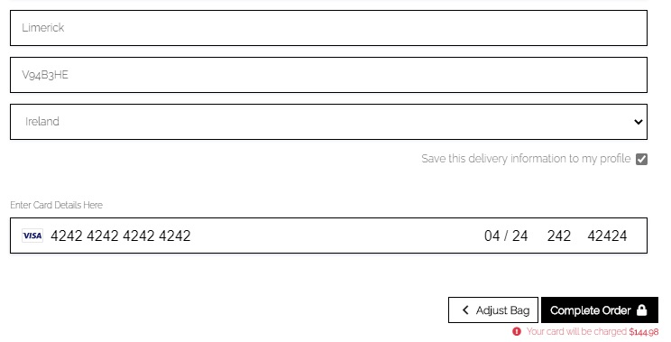

####    View order confirmations
Once a customer entered their card details and elected to proceed with a purchase, they need to be given all details related to the Order to ensure there are no discrepancies. Therefore, to fulfill
this user story, on completion of an Order payment, the customer is presented with a complete breakdown of the processed Order. This Order confirmation contains details of the products included in 
the order, the Delivery address, and the breakdown of the associated charges as illustrated below:


####    Receive Email confirmation after completing purchase
It's important that customers are able to maintain records of their purchases off the site. To fulfil this user story, when an order is successfully processed, an email copy of the order confirmation
is also emailed to the customer.


####    Provide Review and Rating of products purchased
Within eCommerce sites, user feedback is essential to building confidence in your service. Customer feedback in the form of reviews and product ratings are essential components in building this confidence.
To fulfil this user story, if a user has completed an order, they have an opportunity to review the products from that order. Within the customers profile page, all orders associated with that user account
are presented. The customer can select the order number to view specific information about each other. Within the Order details, the customer can elect to leave a review as illustrated below. The Product
Review page allows the user to provide a review for only the products that were within the Order. They can select a rating (between 0 - 5), and a text input.

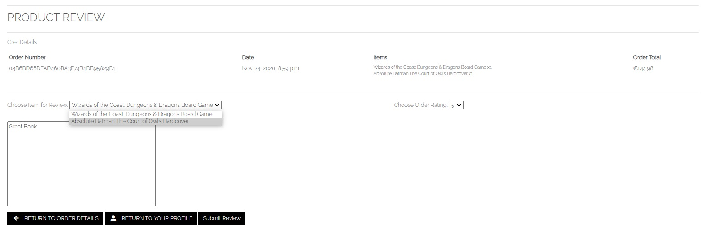

This information is appended to the specific product's detail page, and is used to inform the other customers and promote purchases. More information on this feature is contained within the [Current Features](#Current-Features) section.


### Admin & Product Management
####    Add products
The site admin needs to be able to easily add new products to the store's catalogue. This user story is fulfilled through two mechanisms. Firstly, when we create the Product Model, as discussed in the
upcoming [Product](#Product) section, the Django platform enables us to interact with the model through the Adminstration portal. However, registered suerusers also have the capability of adding products
though the site frontend. For Superusers, within the navbar, When the user selects 'My Account', they are presented with the option of 'Product Management'. This leads to an empty form, that contains
all the requisite fields to create a new product object (Name, Description, has Sizes, Price, Stock Level, Image etc.).

####    Edit/update existing products
Just as important as adding new products is the capability of editing/updating products details. Over the lifetime of a products numerous details may be required to change. For example, the price of 
a product is regularly up for alteration, and in the case of significant proce drops, the category may need to be changed to 'Clearance'. Again, this user story can be fulfilled via the back-end admin
interface, or through the product 'Edit' link, visible to all designated superusers while navigating the site.

####    Delete products
Site Admins very often require the capability to remove products no longer for sale on the site. Just as with the two previous User stories, superusers can elect to use the delete button, visible on
each product (Main Product page and Product Detail pages), or through the Django Admin Interface. 

####    Update inventory number for items
Finally, one of the core features of the site, is the Inventory tracking system. Each time a user completes and order, the stock count is deprecated by that amount. As the stock level decreases, 
a stock warning becomes visible on the Product Detail page. This calls out when the stock level is critical, and when the stock is depleted. Once the stock is depleted, the 'Add to Bag' button is 
disabled, so the customers cannot add the product to an order, that the store can't fulfil (As illustrated in the [View Inventory Status of a product](#view-inventory-status-of-a-product) section). Therefore, when a product is back in stock, the superuser needs to be able to update the stock level for
that specific product, and as such, re-enable the 'Add to Bag' button on that product. As with the above user stories, this functionality can be accessed either by selecting the 'Edit' button on a 
particular product, or indeed accessing the Product object from the Django Admin Interface. 

[Back to top](#Introduction)

## Site Design

Wireframing and Implemented Functionality + Page breakdowns across the site.


### General Site Navigation
The site navigation functionality is all built into the base.html parent template. This contains all default components that all other templates inherit from. All the templates discussed within
this section extend the base template through the use of `block` statements, as illustrated below:
  ```html
  
  {& endblock %}
  ```
The various pages comprising the site need only extend the central base template, and contain only the elements specific to that page. The rest of the components, i.e. the navigation bar, is 
inherited. This separation or components ensures it's easier to scale up the application, as well as maintaining continuity across the site.

The navigation bar utilised bootstrap to ensure the functionality remains responsive across all screen sizes and device types. The site navigation links within the navbar remain consistant, 
however, the other functions change depending on whether the site visitor is logged in or not, or whether they're a superuser or not. As illustrated below, you can see that on larger screens, 
the full navigation bar is visible with all conponents (Anonymous User - Not Logged In). The various site navigation links allow customers to view of products within the specific categories 
as detailed in the [View Category](#View-categories-of-products) user story. Under the 'My Account' Button, users have the options to Register or Login. The appearence of the navbar on large 
screens is illustrated below. In this view, we can also see the additional components visible to anonymous users:
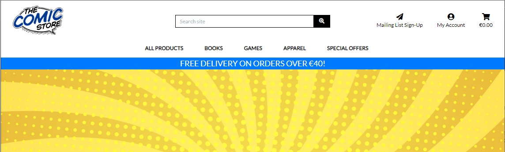

Once a user is logged in, the 'Mailing List Sign-Up' button disappears (Sign-Up is within the Profile Page). The options under the 'My Account' Button also change to 'My Profile' and 'Logout'.
For Superusers/Admin profiles, the user also has the 'Product Management' option, which will be detailed in the [Product Management](#product-management) section. This menu option is illustrated 
below:
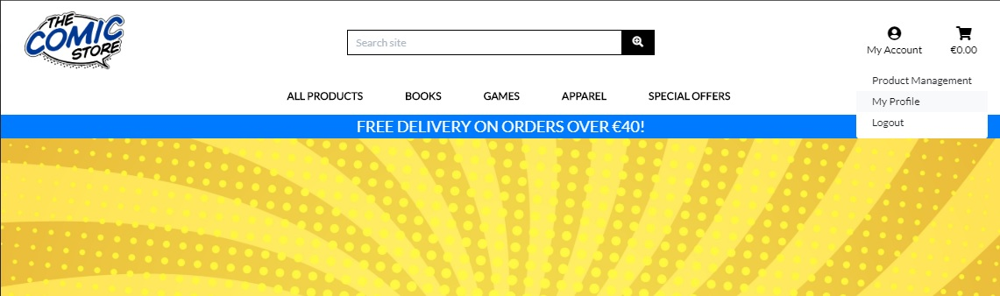

To demonstrate the responsive design of the site, the following illustrates the appearence of the site navigation within smaller screens. The First image illustrates the look of the menu once
compounded to fit small screens. 
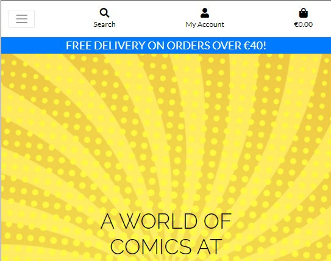 

The following image illustrates the expansion of the navigation menu. Again this demonstrates the responsiveness of the site in catering for smaller screen sizes.
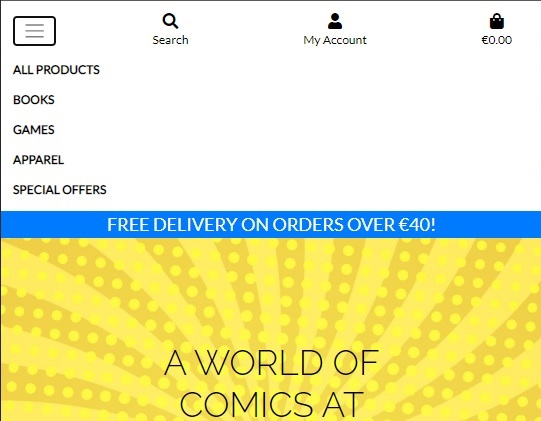
    
### Landing Page
The landing page is a simple page to welcome to the users to the site. The purpose of this page is to direct the customers attention towards the navigation elements, and enable them to quickly
familiarise themselves with the structure of the site. From the landing page, the customers may utilise the navigation functionality to view filtered lists of products, or they may elect to follow
the 'Lets Get Started' button, which brings the customer to the 'All Products' view (no filters). from the landing page, the customer may also register for a profile, or login to a previously 
created profile.


### Product Page
The **Product** page is the hub of the entire site. It's here that the customers can search through all available products on the site. Again, the navigation elements are consistent throughout the
site, so the customer will have many familiar elements. Within the Product page, customers have the option of browsing through all available products, or should they require some more specific,
they can filter down the list of products presented to them. This filtering is faciliated through the navigation elements of the Navbar (as detailed in the [General Site Navigation](#general-site-navigation)
section). The customer also has the option of sorting the presented product list based on Price, Rating, Name, Category, as illustrated below.

Within this page, with respect to the Products themselves, customers are presented with an Image representation of the product, the price of each item, it's category, and it's customer rating.
On this page it's just about giving enough information to attract the customer to click on the item. From there, the user will be brought to the Product Detail page, which contains all information 
about that particular item (Next Section).

The functionality supporting the product page and it's various filters is based within the `all_products` view. This view determines from the incoming user request (i.e. nav selection), how best
to filter the product list for the user.


### Product Detail
The **Product Detail** page allows the user to focus on a specific chosen product, and view additional detail before commiting to the purchase. As with the previously detailed pages, the navigation
elements are again consistant. The customer can again see the name, category, image and product rating. However, they are also now presented with a much more detailed description of thee product 
in question. They are also able to access two very useful pieces of information - The Inventory level and the Product Reviews. The Rating score, and where this calculated, is detailed in the upcoming 
[Product](#product) section. The [Product Review](#product-review) model itself is detailed in the Database section, and the creation of the reviews themselves is discussed in the [Product Review](#product-review) 
section.

In the images below you can see the two main section of the Product Detail page: Details & reviews
*   Details Section - containing all product info and purchasing controls. This section presents the product information, while also allowing the customer to select the quantity they wish to purchase,
and where appropriate the item size.


*   Reviews Section- input from verified purchasers, their score and a text input. This section allows the user to view the input from users who have previously purchased the product. Again, this can 
inform the customer as what they can expect from the product and can be used to give the customer the nudge they need to add the product to their shopping bag.
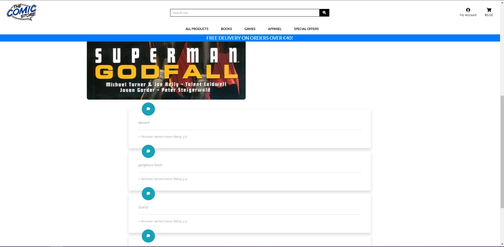

### Shopping Bag
When the customer has selected a product for purchase, they click the **'Add to Bag'** button from the Product Detail page. The customer is then presented with a notification to confirm the item
has been added to their shopping bag as illustrated below. This notification also provides an update on the delivery charges applicable on the purchase. Once the Customer passes the free delivery
threshold (as presented in the banner across the page in blue), the delivery fee is dropped.

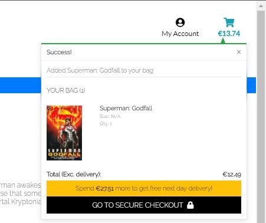

The customer can continue to navigate the site and add items to their bag, and once they are ready to proceed with a purchase, they can either click on the shopping bag icon in the navbar, or
select the **'Go To Secure Checkout'** button from the notification window itself (shown above). The **Shopping bag** itself presents a breakdown of all the items that have been added to the 
bag, including details of the quantity chosen. From this page, the customer can elect to update the quantity of a given item, or indeed delete it from their bag. The pricing of the provisional
order is highlighted to the customer, to let them know what charges will be applied to their card should they proceed. This includes any potential delivery fees, and however much they would need
to add to their shopping bag to proceed without delivery fees, as illustrated below.

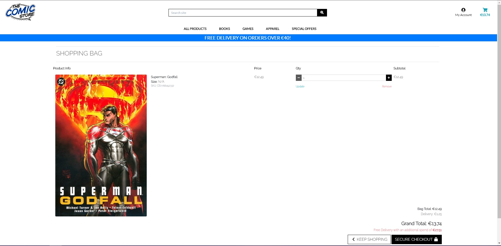

### Checkout Page
The **Checkout Page** is the last stop before the customer completes the purchase of their chosen products. Within this page, the customer is presented with a view the proposed Order details. If
the customer is logged in, the Delivery details form is pre-populated with the information they. If the customer is anonymous, they much fill in these details at this point to the item can be
delivered to them. The customer is also presented with a confirmation of the items associated with their order, so they can be confident in their purchase.

At the bottom of the page, the customer can enter their card details and proceed with the purchase. The card entry field is linked to the [Stripe](https://stripe.com/ie) online payment 
processing platform. 

The following illustrates the Checkout Page:
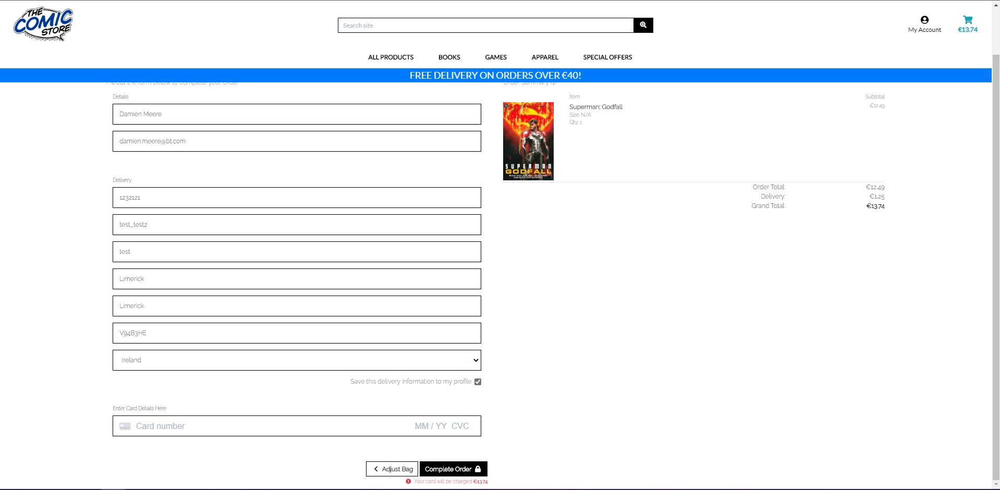

### Completed Order
If the payment is unsuccessful for whatever reason, the user will be redirected back to the Checkout page to address the issue that has arisen. However, Once the payment has been processed 
successfully, the customer is brought to the order confirmation page. Here the customer is presented with confirmation of all details associated with their successful order - i.e. the order
information, the products contained within the order, the delivery address and the billing information, as illustrated below. The user is also presented with a confirmation notification in 
the top right that identifies the order number and the email address to which the confirmation details have been sent. 

Once the customer navigates away from this page, as long as they have a profile created, they can view all successfully processed orders within their profile page, as detailed in the next 
section.

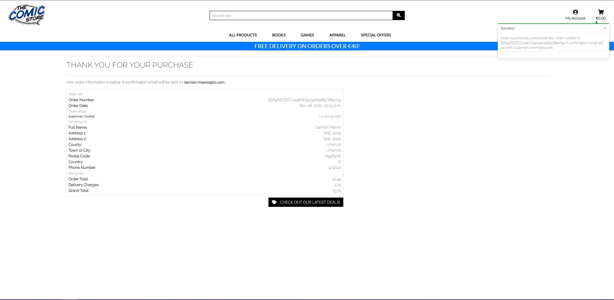

### Profile
Authentication and Accounting of user activity is a core component of any eCommerce site. Users need to be able to track their account activity and make sure users only have access to areas
of the site that are suitable (i.e. ensure only superusers have access to product management and Admin console). Fortunately, Django’s authentication system provides the base structures for 
authorising, authenticating and accounts user interactions with the platform. Details of this system are discussed in the [User & UserProfile Models](#user-&-userprofile-models) section. When
a user creates a profile on the site, they can store delivery information, which ensures that when they proceed to purchase a product, the checkout process is much quicker. The creation of profiles
also enables us to maintain details of successful Orders associated with a particular account. 

The **Profile Page**, accessible via the **'My Account'** button in the navbar, pulls together all of the aforementioned information for the site user. Within their profile pages, customers
can view the Delivery information, currently stored for that user. This information can also be updated if needs be. From here, users can also elect to subscribe to the site's mailing list. The
mailing list enables the site Admin to circulate periodic deals & updates to valued customers, and as such build a stronger brand. The other main component on the Profile page is the Order 
History. The customer's Order History is the complete list of all successful transactions associated with that specific account. All completed order's are accessible for the user to look back
on. By clicking on the individual Order number, the user can view the Order Confirmation, similar to the one presented in the previous section.

The following illustrates the view presented to the customer when they access their Profile page:
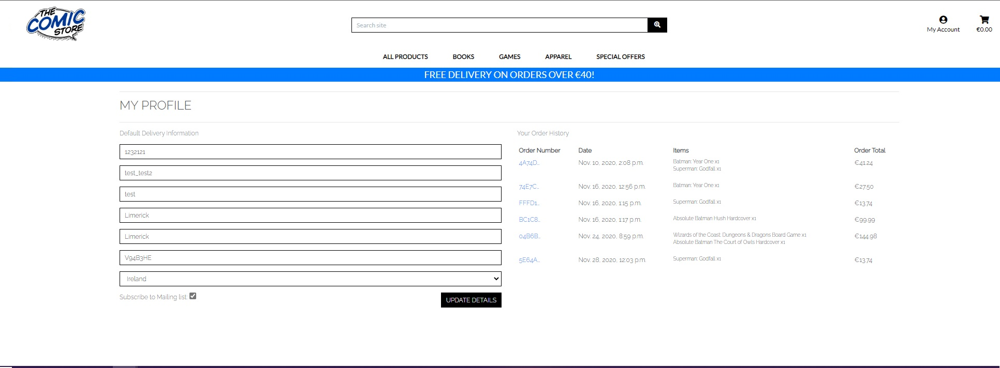

### Order View
Within their Profile page, users are presented with the the full list of all their previous orders on the site, as illustrated above. When the user selects one of the Order numbers, they
can view information similar to that shown for a completed order as shown in the [Completed Order](#completed-order) section. However, the user is presented with an Alert nofication to inform
them they are viewing a past order confirmation. It's importatnt to differentiate the two views. The user is also presented with the option to leave a review for a product associated with one
of their orders. Users can only access the Product Review section of the site through a completed order, via the **'Leave Product Review'** button. This is detailed in the next section. The 
site users view is illustrated in the following, including the Alert notification:

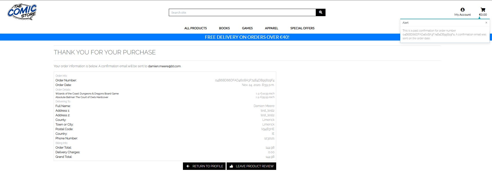

### Product Review
As highlighted in the previous section, the Product review can only be accessed via the Order History section of a user's profile. This ensures that reviews are only captured from customers
that have legitimately purchased that product. When the customer chooses to review a product they've purchased, they are presented with the following view. The customer is again presented 
with a high level view of the order in question, detailing the order number, the timestamp for the order, the products on the order and the total price. The customers have the option to chose 
from the products on the order, which specific product to review. The product dropdown is only populated with the specific products on the order. The feedback from the customer is captured
through two values: the Rating (0-5) and the written review (text). 

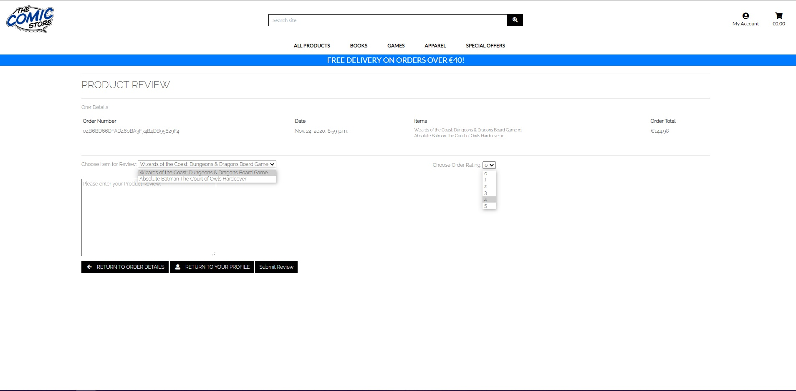

The processing of the value submitted for the Product Rating is detailed in the [Product Review](#product-review) section. Ultimately, all review ratings for each product are averaged, and 
this is the value that is stored within the specific product object in the datebase. The utilisation of the submitted text review in the specific Product Detail page is discussed in the 
[Product Detail](#product-detail) section.

### Product Management
As discussed in the [Admin & Product Management](#admin-&-product-management) section, it's essential that site Admins be able to create, edit/update and delete products as required. As highlighted
in the [Introduction](#introduction), the Django dashboard facilitates all requisite interactions with the site's data structures, including the Product objects themselves. The interface for 
operations on product objects is discussed in detail in the [Product](#product) section. However Superusers also have the option of creating, editing and deleting products from the site itself.

In order to create a new product, superusers have are presented with a 'Product Management' option within the menu for their 'My Account' button. This is only accessible to designated Superusers.
This page presents the user with an empty form with all fields required to create a new Product object. the fields are discussed in detail in the [Product](#product) section. Once the form is 
completed and the user selects the **'Add Product'** button, the product becomes visible to all site visitors from the mmain product page. The Product Management page is illustrated below: 


The mechanism for updating a product is very similar and follows the same template. When the superuser wishes to edit a specific product, they click on the edit link, that appears in both the 
Product Detail and general Product pages. They are brought to a page with the same format, but populated with all the information currently stored for the product. This edit Product view is 
illustrated below:

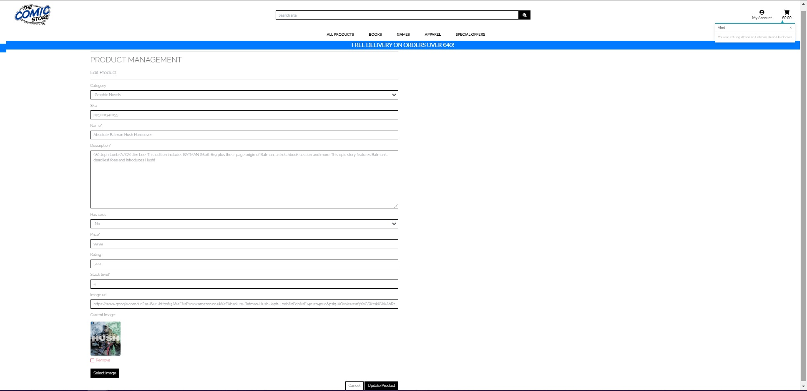

[Back to top](#Introduction)
    
## Technologies Used

#### Languages, Frameworks, Editors, Tools & Version Control:

1. [HTML](https://developer.mozilla.org/en-US/docs/Web/HTML)
2. [CSS](https://developer.mozilla.org/en-US/docs/Web/CSS)
3. [Javascript](https://www.w3schools.com/jsref/)
4. [Python](https://www.python.org/)
5. [Bootstrap](https://getbootstrap.com/) - Responsive site functionality
5. [Django Web Framework](https://www.djangoproject.com/) - Architectural engine
6. [FontAwesome](https://fontawesome.com/) - Icons utilised throughout the site
7. [Git](https://git-scm.com/) - Support of Version Control
8. [Github](https://github.com/) - Host the repository of all previous versions of the build
9. [Gitpod](https://www.gitpod.io/) - Open-source prebuilt, collaborative development environments within your browser
10. [Heroku](https://www.heroku.com/) - Cloud platform as a service enabling deployment 
11. [Stripe](https://stripe.com/ie) - Online payment processing platform
12. [Postgres](https://www.postgresql.org/) - open source object-relational database system
13. [SQLite](www.sqlite.org) - light-weight relational database management system (RDBMS)
14. [Amazon Simple Storage Service](https://aws.amazon.com/s3/) - Amazon S3 - cloud based object storage service

[Back to top](#Introduction)

## Database

During the early development and later local testing of the application, [SQLite](www.sqlite.org) was utilised as the database management system embedded within the 
application itself. This faciliated the early deployment of the User Registration and Authentication system through the django platform. Within the [deployed site](https://dmeere-thecomicstore.herokuapp.com/) 
on Heroku, [Postgres](https://www.postgresql.org/) was employed as the Database to house all data. Postgres is an open source object-relational database management system and is 
installed as an add-on within the Heroku application.

The structure of the database is as follows:

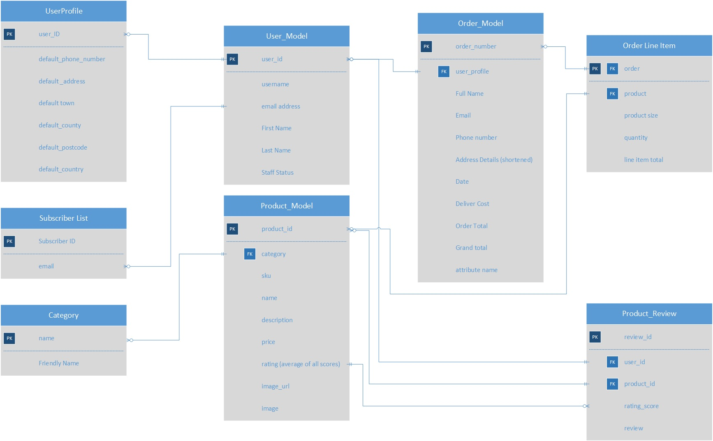

### User & UserProfile Models
Django’s authentication system provides the base structures for authorising, authenticating and accounts user interactions with the platform. The authentication system, bundled as 
a Django contrib module in django.contrib.auth, handles user accounts, groups, permissions and cookie-based user sessions. This default implementation includes the **User model** out of 
the box. User objects are the core of the authentication system. They represent the people interacting with the site and are used to facilitate things like access restrictions, user 
registration etc. 

Within Django’s authentication framework, these user objects represent all users on the site - both Customer and Admin. 'Superusers' or admin 'staff' users 
are just standard user objects with special attributes. The Primary Key for a user is an assigned User ID.

The primary attributes of the default user are:
*   username
*   password
*   email
*   first_name
*   last_name
*   staff status (added to differentiate access privilages)

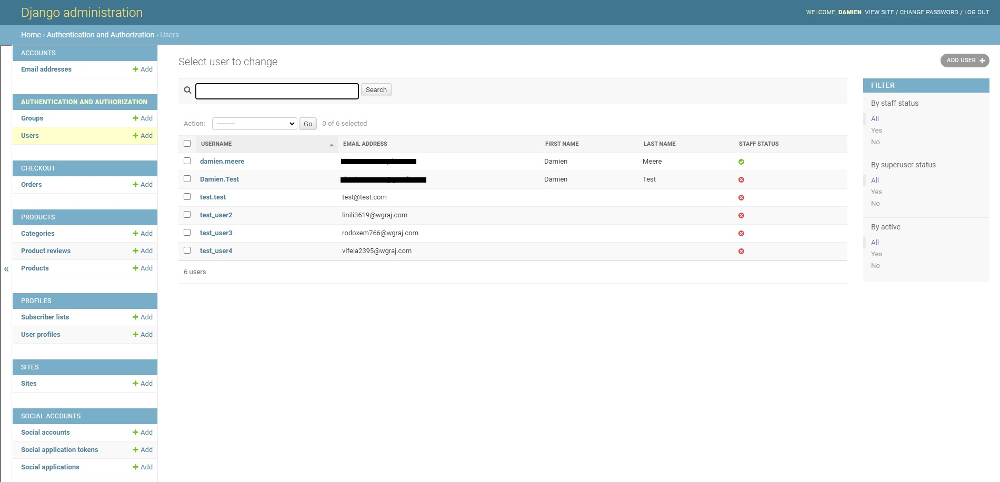

The **UserProfile** model is directly associated with a specific User object, and is used to maintaining default delivery information for that individual. This model maintains a One-to-One 
relationship with it's associated User Object. On deletion of the referenced User object, the related UserProfile object is also deleted. The following fields provide all the information
required to fulfil any orders that the user might make through the site. This is bound directly to the Order model as a Foreign Key. 

*   default_phone_number
*   default_street_address1
*   default_street_address2
*   default_town_or_city
*   default_county
*   default_postcode
*   default_country

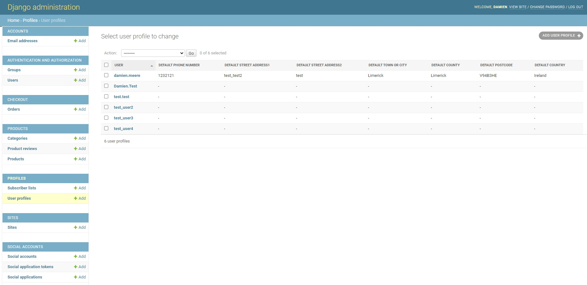

### Subscriber List

The **Subscriber List** Model facilitates the curation of all site users wishing to be part of the site's mailing list. The model maintains only the email address of users, as visitors
to the site can either sign up anonymously (i.e. without a profile) via the home page, or by ticking the subscribe button within the Profile page (once logged in). Logged in users can also
choose to unsubscribe from the list, by un-ticking this button. This process is described in greater detail in the [Current Features](#Current-Features) section.

*   subscriber_id
*   email

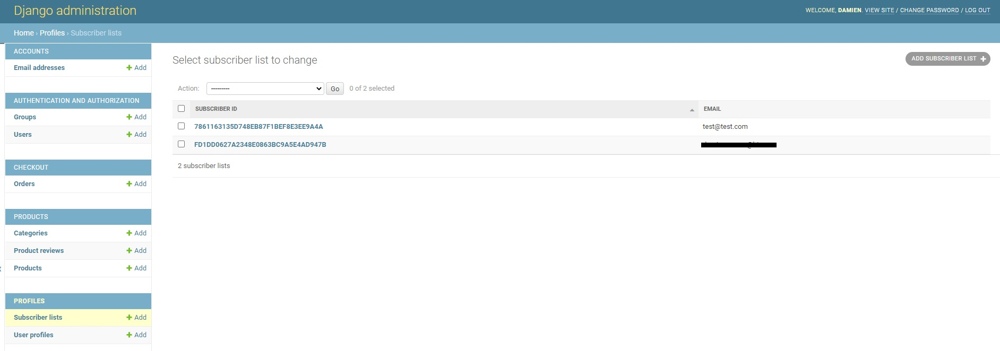

### Product

The **Product** Model contains all details relating to the products being sold on the site. This model links to both the Order Line Item and the Product Review models as a Foreign Key.
The Product model itself contains the Category field as a Foreign Key, which facilitates the differentation of various products types from the main page search functionality. The other
field within this model describe the product itself and it's status. For example, the SKU (Stock Keeping Unit) is product code that you can use to search and identify stock on hand 
from lists, invoices, or order forms. It's typically used to facilitate inventory management. The Name, Description, Price and Image field allow customers to view information about 
product before purchase. The has_sizes field is utilised to discern if a product is an item of clothing, and whether the customer should be able to pick the requisite size (S, M, L, XL etc.).

The Ratings field is tied directly to the **Product_Review** model. The value in this field is calculated by getting the average of all review scores submitted by confirmed purchasers
of the specific product. The Reviewing process will be discussed in more detail in the [Current Features](#Current-Features) section. Finally, the Stock_level Field is dtermined by 
site admin. When the admin sets this value, the users are presented with a notification on the product detail page to highlight current stock levels. When the stock level drops to a 
critical level, the customer is provided with a warning to promote the purchase. When the stock is exhausted (0 remaining), the ADD TO BAG button on the product detail page is removed.
This prevents users from adding a product to their shopping bag, when we no long have the product in stock.

*   category
*   sku
*   name
*   description
*   has_sizes
*   price
*   rating
*   stock_level
*   image_url
*   image

**Product Admin**
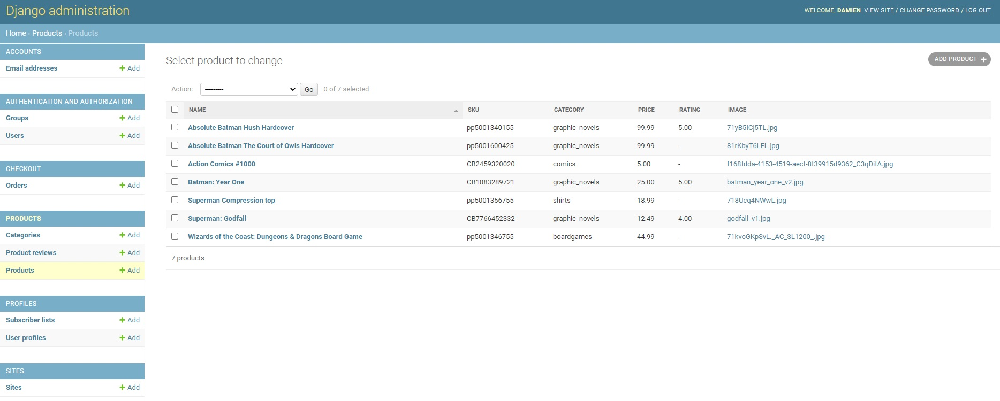

**Product Detail Admin**
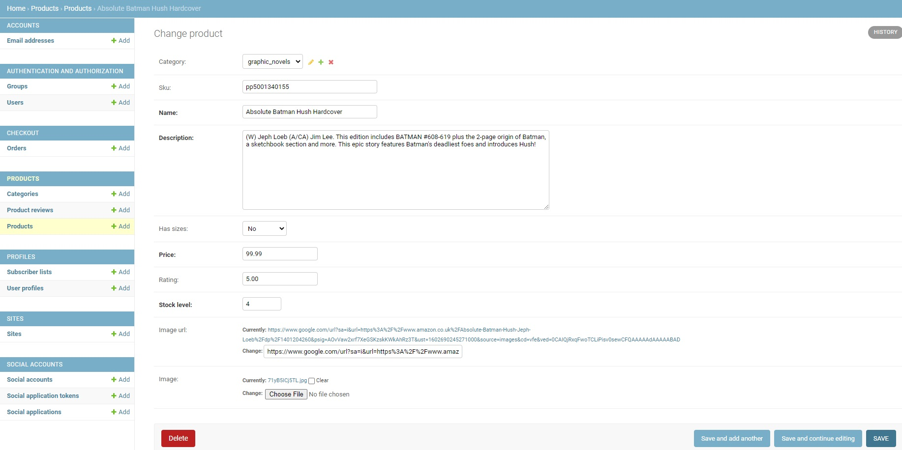

### Product Review

The **Product Review** Model is utilised to harness feedback from confirmed product purchasers. Only those users that have completed an order (accessible via their profile) can 
submit a review for a product. Even then, they can only provide a review for a product that are associated with their Order. The process or creating and viewing product reviews 
will be details in the [Current Features](#Current-Features) section. The various fields within the model support this function. The review_id field is utilised to uniquely identify
each review record within the datebase. The user field identifies the user that submits the review. This detail is used to populate the review section within the Product Detail
page. 

The Product field is a foreign key and associates the review with a specific product. On deletion of the product in question, all associated product reviews are deleted. The 
review (Text input) and Timestamp (gathered at the time of submission - `datetime.now()`) are used to provide additional information on the Product detail page. The product detail 
page will tabulate the various reviews associated with the specific Product. Finally, the ratings field is just an integer value between 0-5. The user can select their input within a dropdown menu with submitting their review. The actual rating assigned to the Product
object itself is actually the average of all submitted review scores. On successful submission of a review, the ratings score is averaged across all reviews for that product. The 
result is saved to the original Product Object rating field, as detailed above. 

*   review_id
*   user
*   product
*   rating
*   review
*   timestamp

**Product Review Admin**
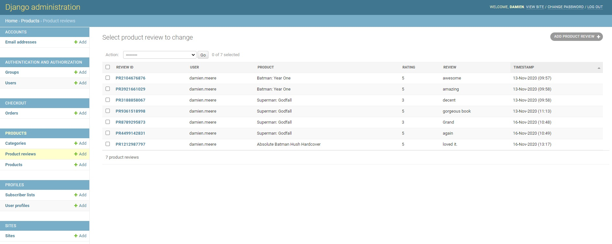

**Product Review Detail Admin**


### Category

The **Category** Model is utilised to provide additional context to the Products (Foreign key within Product Model). The categories are used to differentiate and group products within
the store's inventory. The model is limited to two field that provide a name, and a "Friendly" version of that name

*   name
*   friendly_name

**Category Admin**
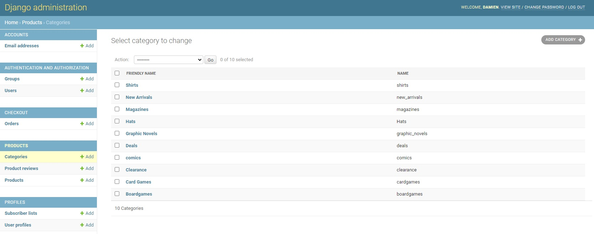

### Order

The **Order** Model is one of the key models supporting the checkout application, and as such, the purchasing capability within the site. The Order Model is used to harness the various
pieces of information required do fulfil a customers order (Delivery Information), harnessed from the User Profile (for logged in users).

The Order model links directly to the UserProfile model (Foreign Key) and as such binds an order to a specific user profile. Order Model contains all the  The Order Model also details
the various costs associated with an order (i.e. Delivery Cost, Order Total, Grand Total). These values are dependant on the associated Order Line Items (Detailed Below). The Stipe 
Payment ID contains the identifier that can be matched against Stripe records to ensure payment has been received before processing the customers order and arranging for the delivery
of the products within the Order.

*   order_number
*   user_profile = models.ForeignKey(UserProfile)
*   full_name
*   email
*   phone_number
*   country
*   postcode
*   town_or_city
*   street_address1
*   street_address2
*   county
*   date
*   delivery_cost
*   order_total
*   grand_total
*   original_bag
*   stripe_pid

**Order Admin**
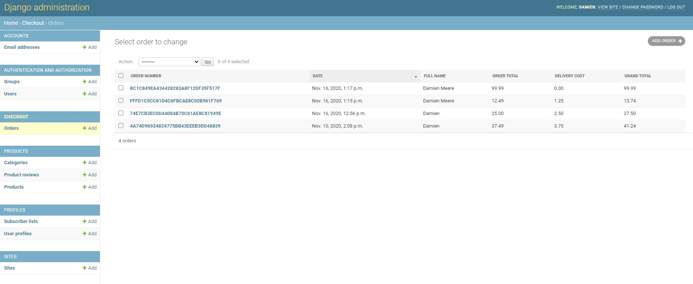

**Order Detail Admin**
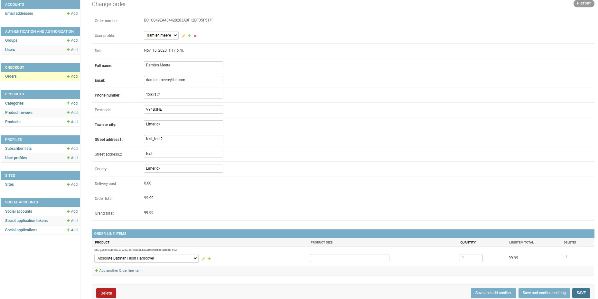

### Order Line Item

The **Order Line Item** Model prodvides the specific product context for the Order Model. The Order Line Item is bound to the Order Model and the Product Model. Both Order and Product
are Foreign Keys within the Order Line Item. When the user creates an order, the contents of their 'Shopping Bag' are iteratted over to create an individual Order Line Item instance,
which details the requisite order number, the requisite product ID, the details of product size where applicable (in the case of clothing) the quantity, and finally the total for that 
particular line item, based on the aforementioned information. Within the Admin interface, the Order Line Items are visible within the output of the specific associated Order, as illustrated
below.

*   order
*   product
*   product_size
*   quantity
*   lineitem_total

**Order Line Item Admin**
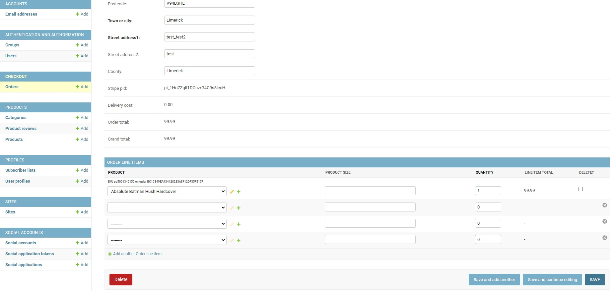

## Current-Features
This project is built on Django 3.1.2, which facilitates the back-end Admin infrastructure. This foundation, and its support of the Jinja templating framework allows for the separation or 
components, ann therefore the requisite scalability, as well as maintaining continuity across the site. Again, Bootstrap was utilised to facilitate page structure and display elements across 
the various templates. This continuity is hugely important to the overall user experience. The utilisation of Bootstrap ensures that the project is full responsive across all browsers and 
device sizes. The project also utilises the Stripe online payment processing platform to facilitate card payments, and where required, the appropriate handling to payment errors.

Within the project, the following are some of the key features:
*   Django-based Admin Portal
*   User accounts + User Authentication, Authorisation and Accounting (Order History)
*   Site navigation mapped to the specific User-type - Anonymous/Authenticated, User/Superuser 
*   Implementation of AWS S3 Bucket to host the static (js & css files) and media folders (site images)
*   eCommerce functionality facilitated through Stripe
*   Responsive page design with product filter functionality, allowing users to view, sort and filter products depanding on their requirements
*   Product Review and rating system to harness feedback from customers to better inform the purchases of future customers
*   Mailing list system, allowing anonymous or authenticated users to subscribe for site circulations
*   Product Inventory system that allows for admins to ensure that users can only generate orders for products confirmed to be in stock

### Defensive Design
Defensive Design is all about designing for when things go wrong. It's all about anticipating both user and website error. When developing this project, defensive design was employed throughout
all views, forms, models & templates, with all defensive elements tested extensively throughout the local test environment and within the deployed live application. Defensive elements included
things like:
*   Employing field and form validation to check for mistakes in user inputs
*   Protecting site visitors from server errors and broken links with informative messages
*   Assists the user before mistakes happen

It's ultimately about ensuring that all user inteactions with the site can be accounted for, and that we can be confident that all user activity can be catered for. 

There are a number of defensive elements at play with relation to site registration and navigation. Firstly, when a user is registering for an account, the username field is validated to 
ensure the inputted value is in fact unique. With regards to navigating around the site, all areas of the site can been linked to, however, should the user attempt to access certain areas of 
the site that require a user to be authenticated, or indeed authenticated as a superuser, they will generally be directed back to the Landing Page, or where appropriate, to the login page. This
can happen should the user attempt browser url injection to get to gain access to areas of the site e.g. if a user is logged in and attempts to access `https://dmeere-thecomicstore.herokuapp.com/accounts/login/`,
they are directed back to the landing page. Utimately, the site will attempt to bring the user back to the normal flow of the site, where appropriate for their level of access.

This same approach is employed should a normal user attempt to access an area locked behind Authentication via url injection. An example of this is when a user attempts to access the Product 
Management area (`https://dmeere-thecomicstore.herokuapp.com/products/add/`). This area is exclusive to superusers, and inappropriate for normal user accounts. Therefore, when a normal user
inputs this URL, there are again just redirected back to the Landing page. 

The site itself makes use of forms in a number of areas to capture user inputs. From the perspective of superusers, product objects are created within the Product Management form. And normal
users can input product reviews. Within these forms, all fields are built with the most appropriatefield type in mind. User inputs are validated to ensure that all data provided is suitable 
for the underlying model, as discussed in the [Database](#Database) section.

## Future-Features
A number of features are planned for the next iteration of this project. They are as follows:
*   Support for users updating posted product reviews. In conjunction with this functionality, the plan is to also expand the user's profile page to not only highlight previously created orders,
but also track this posted reviews.
*   Implementation of customer feedback to posted reviews (i.e. 'I found this Useful'). This enables users to better trust the feedback provided.
*   Price Reduction Notification system. Should there be a drop in the price to a item, as well as moving the item to the 'Clearance' or 'Deals' categories, also provide a visual cue to highlight
the scale of the reduction within the item price placeholder.
*   Currently, when an item is out of stock, users cannot add the item to their bag. In the next iteration of the site, the users will have the option to put the item on back order, and request
priority access to the product once it's back in stock.
*   User Account Disable/Delete functionality - should the user wish to terminate thier account for whatever reason, have the option available.

[Back to top](#Introduction)

## Testing
Throughout the development of this project, validation and testing was performed on all aspects of the project. Core to this process was the validation against the User stories highlighted in 
the [UX + User Stories](#UX+User-Stories) section. All functionality was tested, with defensive design principles adhered to throughout. An Excel-based 
was used to track the development of the application.
    
Throughout the development of the site, the use of templating structures anfd Jinja expressions meant it was difficult to validate through online validators. However, where possible, CSS, HTML
and Javascript files/code were passed through code validators to ensure there were no outstanding errors. I found it useful to 'Inspect' outputted pages, copy the underlying HTML and pass this
through the validators to search for and correct any outstanding errors. The [CSS Validator](https://jigsaw.w3.org/css-validator/) & [HTML Validator](https://validator.w3.org) were utilised to check the 
markup validity of Web documents against the w3c standards. the [JSHint](https://jshint.com/) utility was used to check for errors and potential problems in the JavaScript code. Gitpod was
the IDE of choice while this application was being developed. The Flake8 Python library was a great toolkit for checking the code base for styling and programatic errors. More often than not,
errors in the code were caught here.

> NOTE:
> Flake8 did call out in a number of cases that certain lines were too long. I attempted to use an appropriate escape and indentation to continue the code on the next line and reduce the line 
> length, however in a number of cases this resulted in additional errors arising elsewhere in the code. So in a number of cases, I chose to ignore the line length error i favour of maintaining
> the integrity of the application.


This site itself was tested across multiple browsers (Chrome, Safari, Firefox), and on multiple devices (Samsung Galaxy S9/S10/S20, Samsung Galaxy Tab, Apple iPad, iPhone) to ensure compatibility
and responsiveness. As detailed in previous sections, depending on the screen size, the structure of pages shifted to ensure usability in unaffected by the access mechanism.

[Back to top](#Introduction)

## Deployment
A live iteration of this project can be found deployed to [Heroku](https://dmeere-thecomicstore.herokuapp.com/)

To run locally, you can clone this repository directly into the editor of your choice by pasting `git clone https://github.com/damien-meere/Data-Centric-Development-Milestone-Project.git` 
into your terminal. To cut ties with this GitHub repository, type `git remote rm origin` into the terminal.

>NOTE:
>Ensure that when testing with the Stripe-supported payment system, utilise the [Stripe Testing](https://stripe.com/docs/testing#cards) details. 
>Throughout the development of this project the followig details were utilised - Card number: 4242424242424242 (16-digit Card number), CVV & Date: Any digit combinations you wish.

You can also Clone this Repository to GitHub Desktop, by navigating to the [main page](https://github.com/damien-meere/full_stack_milestone) of the 
repository on GitHub, under the repository name, click Clone or download. Click Open in Desktop to clone the repository and open it in GitHub Desktop. Click Choose... and, 
using Windows Explorer, navigate to a local path where you want to clone the repository. For more information you can 
review the [GitHub site](https://help.github.com/en/articles/cloning-a-repository#cloning-a-repository-to-github-desktop).

To deploy the project to Heroku you will need to do the following:
1.  Create a new app on [Heroku](https://www.heroku.com/)
2.  Linked the app to its Github repository shown above
3.  Verify that the project has an up to date Procfile and requirements.txt
4.  Ensure you have Heroku set up as a remote repo (`git remote -v`)
5.  Push the project to the Heroku remote (`git push heroku master`)
6.  Set the requisite environmental variables/confirg vars on heroku:
    *   AWS_ACCESS_KEY_ID (S3 Application)
    *   AWS_SECRET_ACCESS_KEY (S3 Application)
    *   DATABASE_URL (Provisioned Postgres Database)
    *   SECRET_KEY
    *   STRIPE_PUBLIC_KEY
    *   STRIPE_SECRET_KEY
    *   STRIPE_WH_SECRET
8.  Restart all dynos.
9.  Open the app on Heroku and check to ensure that it's working correctly.

[Back to top](#Introduction)

###### <i>Disclaimer: This project (Milestone 4) was created for educational purposes as part of the Code Institute's Full Stack Software Development Course.</i>

<p align="center">
    
</p>